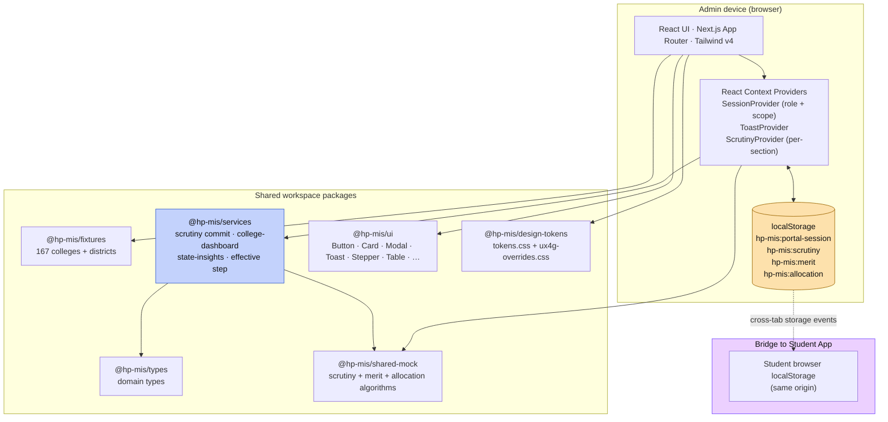
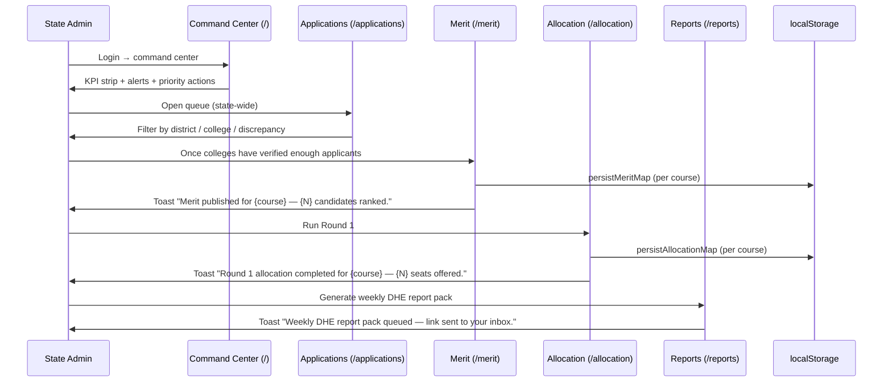
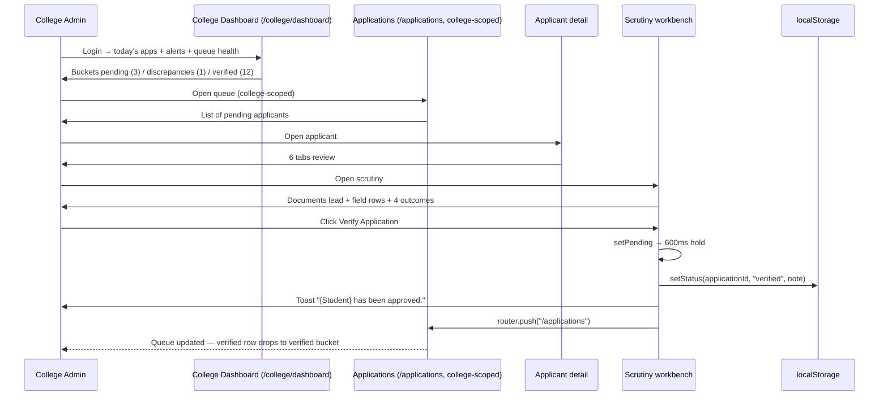
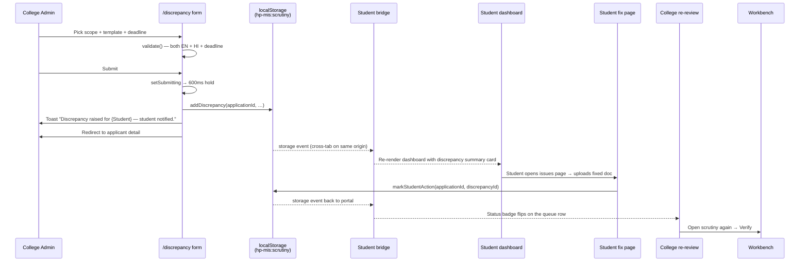

# HP Higher Education MIS — Portal App: Project Report

> **Document scope:** the UX4G-style Government of India admin portal (`apps/portal`).
> **Companion report:** `docs/STUDENT_APP_REPORT.md` covers the SwiftChat-style student mini-app (`apps/student`).
> **Last verified:** evidence in this report is grounded in the working tree at the time of writing (13 page routes, 2 React Context providers + per-section ScrutinyProvider, 6 shared workspace packages, no Node backend).

---

## 1. Project Title

**HPU Admission — Admin Portal**
The official Government of Himachal Pradesh / Department of Higher Education admin workspace for managing the undergraduate admission lifecycle. Used by State Admin (DHE) and College Admin staff across HPU-affiliated institutions.

---

## 2. Executive Summary

The Portal App is the official admin surface inside the HP Higher Education MIS monorepo. It serves two distinct administrator roles:

- **State Admin** (Directorate of Higher Education): runs the cycle (cycle setup, merit publication, allocation rounds), monitors KPIs across all 167 HPU-affiliated colleges, and publishes policy alerts.
- **College Admin** (per-college principal / operator): owns scrutiny for their college's queue, manages seat matrix, runs the daily operations dashboard.

The portal follows the **UX4G Design System v2.0.8** (NeGD / MeitY) as primary authority — Government of India violet brand `#613AF5`, Noto Sans typography, formal radius, government-grade shadows, and the canonical four-column GoI footer. The portal feels **official**, **structured**, and **data-rich** — modelled on PM GatiShakti dashboards, the National Scholarship Portal, and NIC-built MIS systems.

The app is built in Next.js 16 (App Router) with React 19 and Tailwind CSS v4. There is **no backend service** in this build: scrutiny outcomes, merit publications, and allocation runs are persisted to browser `localStorage` keys that the student app's bridge providers read on the same origin. A typed services layer (`@hp-mis/services`) holds the pure derivations (effective scrutiny status, college-dashboard rollups, scrutiny commit orchestration, state insights).

Every primary action in the portal — Verify Application, Conditional Accept, Reject, Raise Discrepancy, Publish Merit, Republish, Run Allocation, Rerun, Download CSV / XLSX, Generate Weekly Report, Download Seat Matrix — has a loading state, a named-entity success toast, and either a redirect or an in-place state update. There is no "dead" CTA on any page.

---

## 3. Problem Statement

Undergraduate admission to HPU's affiliated colleges is currently coordinated across spreadsheets, paper forms, and disconnected vendor portals. Reviewers verify the same applicant twice, the State has no real-time visibility into discrepancies across colleges, merit lists are published as PDFs, and seat allocation is manually computed. The portal consolidates the scrutiny + merit + allocation lifecycle into one role-aware MIS so a College Admin in Sirmaur and a State Admin in Shimla operate against the same data.

---

## 4. Project Objectives

1. **Single official MIS** — scrutiny, merit, allocation, reports in one role-aware portal.
2. **UX4G compliance** — typography, colours, radius, focus rings, footer all match the Government of India design system v2.0.8.
3. **Accessibility-first** — WCAG 2.1 AA compliant; every focusable element has a visible focus ring; status messages announce; keyboard navigation works throughout.
4. **Insight-first dashboards** — both the State command center and the College overview lead with KPIs + alerts, not raw tables.
5. **Workbench-grade scrutiny** — the per-applicant scrutiny page mirrors how a real college reviewer works: documents lead, four outcomes side-by-side at the bottom, every action committed via a 600 ms loading hold + named-applicant toast + redirect to queue.
6. **No demo-feel copy** — production-tone strings throughout, audited and stripped of "Demo build", "Demo hero" labels.

---

## 5. Target Users

| Role | Profile | Primary surfaces |
|---|---|---|
| **State Admin** (DHE) | Director / Joint Director of Higher Education, plus support analysts | Higher Education Command Center (`/`), Cycle setup, Applications (state-wide queue), Merit, Allocation, Reports, Policy Alerts, Student Lifecycle |
| **College Admin** (Principal / Operator) | College principal or designated operator at each of the 167 affiliated colleges | College Dashboard, Applications (college-scoped queue), Scrutiny workbench, Seat matrix, Reports |
| **Demo presenter** | Internal stakeholder showing officials end-to-end | Both roles via the Role Switcher |

The portal is **not** intended for students. Students use `apps/student`.

The repo's `RoleCode` type defines `state_admin | college_admin | operator | convenor | finance | dhe_secretary | student`. V1 ships state_admin and college_admin as functional roles; the others are placeholders for Phase 2.

---

## 6. Scope of the Portal

### In scope (V1)
- State Admin command center with KPIs, district enrollment, district-level vacancy, finance, infrastructure, decision insights, priority actions
- Cycle Setup (read-only summary in V1) — phases, key windows, ownership card, rules summary, reservation categories
- Applications queue with full filter toolbar (search + 7 filters + smart sorting)
- Application detail (6 tabs: Applicant, Academic, Claims, Documents, Preferences, History)
- Scrutiny workbench (per-applicant — documents + field review + 4 outcomes)
- Discrepancy raise flow (4 scopes, 2 reason templates × 2 languages, deadline picker)
- Merit publication (per-course, computes ranks from verified applications, persists)
- Seat allocation (per-course, runs first-preference allocator, persists)
- College dashboard (today's apps, pending scrutiny, discrepancies, queue health, alerts)
- Seat matrix (full table per college with 7 categories + totals + DHE approval status)
- Reports (status, category, district, seat fill — with CSV / XLSX / Weekly export CTAs)
- Policy alerts page (severity, scope, status, SLA)
- Student lifecycle dashboard (state-level retention metrics)
- Role switcher (toggle State Admin ⇄ College Admin during demo)

### Explicitly out of scope (V1)
- Real authentication (no SSO / OTP / Aadhaar bridge)
- Backend API (everything is `localStorage`)
- Cycle authoring (Cycle Setup is read-only in V1)
- Postgraduate workflows
- Inter-college transfers
- Phase 2 modules (per project-context.md §2)

---

## 7. High-Level Architecture



**Key architectural decisions:**

- **No Node backend.** Every persistent admin action (verify, raise discrepancy, publish merit, run allocation) writes to a `localStorage` key. On the same browser origin, the student app's bridge providers (`ScrutinyBridgeProvider`, `AllotmentBridgeProvider`) listen for storage events and re-render — the student sees the admin action without a refresh. On `localhost` (separate origins for ports 3001 and 3002), the bridge is best-effort; on a deployed single-origin build it is live.
- **Per-section provider mounting.** `ScrutinyProvider` is NOT mounted globally; it lives in three section layouts (`apps/portal/app/applications/layout.tsx`, `apps/portal/app/merit/layout.tsx`, `apps/portal/app/allocation/layout.tsx`, and the new `apps/portal/app/college/layout.tsx` for college pages that need scrutiny derivations). This keeps the provider tree light on pages that don't need scrutiny state.
- **Service layer.** Business orchestration that doesn't need React (commit-scrutiny logic, college-dashboard rollups, state-insights summarisation) lives in `@hp-mis/services` as pure functions. Pages stay thin: providers + services → JSX.
- **Two-track design tokens.** The portal imports `tokens.css` (SwiftChat base) AND `ux4g-overrides.css` (UX4G primitives that win the cascade). The student app imports only `tokens.css`. Same token names, different hex values per app.

---

## 8. Monorepo Structure

```
hp-mis/
├── apps/
│   ├── student/             ← see STUDENT_APP_REPORT.md
│   └── portal/              ← THIS REPORT covers this app
├── packages/
│   ├── ui/                  ← shared React primitives
│   ├── design-tokens/
│   │   └── src/
│   │       ├── tokens.css           ← SwiftChat base (both apps)
│   │       ├── ux4g-overrides.css   ← UX4G primitives (portal only)
│   │       └── fonts.css
│   ├── services/            ← pure orchestration + derivation
│   ├── types/               ← shared domain types
│   ├── fixtures/            ← seeded colleges + districts
│   ├── shared-mock/         ← storage adapters + merit/allocation algorithms
│   └── i18n/                ← en/hi locale strings (used by student; portal is EN-only)
├── pnpm-workspace.yaml
├── turbo.json
└── tsconfig.base.json
```

The portal at port `3002` (dev), the student at `3001`. Both share the same workspace packages so changes to a domain type or shared primitive propagate to both.

---

## 9. Technology Stack

| Layer | Technology | Version |
|---|---|---|
| Framework | Next.js (App Router) | 16.2.4 |
| UI library | React | 19.2.4 |
| Styling | Tailwind CSS v4 with `@theme inline` | 4.x |
| Language | TypeScript | ^5.6.3 |
| Latin font | Noto Sans (UX4G mandated, via `next/font/google`) | weights 400 / 500 / 600 / 700 |
| Devanagari font | Noto Sans Devanagari (sparingly — admin chrome is largely EN-only) | weights 400 / 500 / 600 / 700 |
| Package manager | pnpm | 10.33.0 |
| Build orchestration | Turborepo | ^2.9.6 |
| State management | React Context + `useState` (no Redux/Zustand) | — |
| Persistence | Browser `localStorage` (4 keys, all `hp-mis:*` prefixed) | — |
| Charts | SVG inline (no third-party charting lib) | — |
| Tables | `@hp-mis/ui` `Table*` primitives (semantic HTML wrapped) | — |
| Testing framework | None configured in V1 | — |

---

## 10. Design System Strategy

The portal follows the **UX4G v2.0.8 design system** (NeGD / MeitY, Government of India) as primary authority. Reference: `https://doc.ux4g.gov.in`.

| Foundation | Choice | Where defined |
|---|---|---|
| Brand colour | `#613AF5` (UX4G violet) | `packages/design-tokens/src/ux4g-overrides.css` |
| Latin face | Noto Sans | `apps/portal/app/layout.tsx` (loaded via `next/font/google` as `--font-noto-sans`) |
| Status colours | UX4G fills + WCAG-AA text variants — success `#3C9718` / `#005A00`, danger `#B7131A` / `#741010`, warning `#BB772B` / `#8B5000`, info `#84A2F4` / `#345CCC` | `--color-status-*` |
| Border radius | UX4G scale — 4 / 6 / 8 / 16 / 32 / 100 px (`--radius-sm/-md/-lg/-xl/-2xl/-pill`) | `--radius-*` |
| Body bg | `#FFFFFF` | `--color-background` |
| Card bg | `#FFFFFF` | `--color-surface` |
| Border | `#DEDBEC` (UX4G neutral-100) | `--color-border` |
| Focus ring | `0 0 0 4px rgba(97, 58, 245, 0.50)` (UX4G violet at 50%) | `--focus-ring` |
| Shadows | UX4G two-stop depth: `0px 1px 2px rgba(0,0,0,.30) + 0px 1px 3px 1px rgba(0,0,0,.15)` | `--shadow-sm/-md/-lg` |
| Footer | Government 4-column (About / Policies / Contact / Support) + WCAG strip + NeGD attribution | `apps/portal/app/_components/portal-frame.tsx` |

**Override layering:** the portal's `globals.css` imports `tokens.css` first then `ux4g-overrides.css` — UX4G primitives win the cascade. The student app imports only `tokens.css`. Token names are identical across both surfaces (`--color-interactive-primary`, `--color-text-primary`, `--hp-primary-*`), so every shared `@hp-mis/ui` component renders correctly under either theme — only the underlying hex values shift.

**Why this two-track approach:** the project's CLAUDE.md mandates two surfaces (student SwiftChat + portal UX4G). They must read as visually distinct products, not the same brand twice. The override approach delivers that without code branching at the component level.

---

## 11. Portal App Overview

The portal app sits at port `3002` in dev (`pnpm --filter portal dev`).

| Concern | Solution |
|---|---|
| Routing | Next.js App Router, file-based; `page.tsx` per route, optional `layout.tsx` per section |
| Page chrome | `apps/portal/app/_components/portal-frame.tsx` — sidebar (left) + sticky header + main area + footer |
| Sidebar nav | 8 role-aware items (Overview, Applications, College Dashboard, Cycle, Seats, Merit, Allocation, Reports) — filtered by `session.role` |
| Role switcher | `apps/portal/app/_components/admin/role-switcher.tsx` — top-right of header — toggles state_admin ⇄ college_admin during demo |
| Section providers | `ScrutinyProvider` mounted in the four section layouts that need it; `SessionProvider` + `ToastProvider` mounted at app root |
| Insights components | `apps/portal/app/_components/admin/insights/` — `KPICard`, `LineChart`, `DonutChart`, `AlertsPanel`, `PriorityActions`, `DecisionInsightPanel`, `DashboardHeader`, `insights-data.ts` (404 lines of seeded mock data) |
| Workbench primitives | `apps/portal/app/_components/admin/` — `ApplicationSummaryHeader`, `ReviewSectionCard`, `FieldReviewRow`, `DocumentReviewCard`, `ReviewerIdentityBlock`, `ActionFooter`, `SummaryStrip`, `FilterBar`, `ApplicationQueueTable`, `TabNav`, `StudentMessagePreview` |

**Provider tree** at `apps/portal/app/layout.tsx`:

```
SessionProvider
  └── ToastProvider
      └── { children }
```

Per-section nesting (e.g. `apps/portal/app/applications/layout.tsx`):

```
ScrutinyProvider
  └── { children }
```

The pattern keeps `ScrutinyProvider` out of pages that don't need it (e.g. State Admin command center).

---

## 12. Portal User Roles

The Session Provider holds the active role (persisted to `hp-mis:portal-session`). The role determines which sidebar items show, which page content renders, and which CTA actions are available.

| Role | Sidebar visibility | Default landing |
|---|---|---|
| **state_admin** | Overview (`/`), Applications (state-wide), Cycle, Merit, Allocation, Reports, (and the state-only pages /state/cycle, /state/lifecycle, /state/alerts) | `/` (Higher Education Command Center) |
| **college_admin** | Overview (`/college/dashboard`), Applications (college-scoped), College Dashboard, Seats, Reports | `/college/dashboard` |

Other roles defined in `RoleCode` (`operator`, `convenor`, `finance`, `dhe_secretary`) are placeholders — not exercised in V1.

**Role-gated pages.** Pages enforce role at runtime: e.g. `/merit` and `/allocation` show a "Role required" card to non-state-admin users; `/college/seats` shows a "switch to College Admin" message to non-college-admin users. This makes the demo bullet-proof — switching roles via the top-right RoleSwitcher transparently updates page content.

---

## 13. Portal Pages — Page Inventory

The portal ships **13 routes**. Every route below has been verified against the working tree.

| Route | File | Visible to | Purpose |
|---|---|---|---|
| `/` | `apps/portal/app/page.tsx` | state_admin | Higher Education Command Center — KPI strip, district enrollment, finance, infra, alerts, priority actions, decision insights |
| `/applications` | `apps/portal/app/applications/page.tsx` | state_admin (state-wide queue) + college_admin (college-scoped) | Applications queue with full FilterBar (search + 7 filters) + ApplicationQueueTable |
| `/applications/[applicationId]` | `apps/portal/app/applications/[applicationId]/page.tsx` | state_admin + college_admin | Applicant detail — 6 tabs (Applicant / Academic / Claims / Documents / Preferences / History) + ActionFooter |
| `/applications/[applicationId]/scrutiny` | `apps/portal/app/applications/[applicationId]/scrutiny/page.tsx` | college_admin (typically) | Scrutiny workbench — documents + field review + 4 outcome buttons (Verify / Conditional / Reject / Discrepancy) |
| `/applications/[applicationId]/discrepancy` | `apps/portal/app/applications/[applicationId]/discrepancy/page.tsx` | college_admin | Raise discrepancy form — scope (4 segments) + document picker + EN/HI reason templates + deadline + preview panel |
| `/college/dashboard` | `apps/portal/app/college/dashboard/page.tsx` | college_admin | College overview / "My college" — KPIs + alerts + next-actions + category / today-vs-yesterday / queue-health insights |
| `/college/seats` | `apps/portal/app/college/seats/page.tsx` | college_admin | Seat matrix — full table (course × 7 categories) + totals row + DHE approval badge + Download matrix CTA |
| `/state/cycle` | `apps/portal/app/state/cycle/page.tsx` | state_admin | Cycle setup — phase timeline + ownership card + key windows + rules summary + reservation categories table |
| `/state/lifecycle` | `apps/portal/app/state/lifecycle/page.tsx` | state_admin | Student lifecycle metrics — retention KPIs + enrollment trend + gender donut + high-risk cohorts + rural/urban split |
| `/state/alerts` | `apps/portal/app/state/alerts/page.tsx` | state_admin | Policy alerts feed — alert table with severity / scope / status / SLA + recommended actions |
| `/merit` | `apps/portal/app/merit/page.tsx` | state_admin | Merit compilation — per-course Publish / Republish CTA with loading + named-course toast + rank table |
| `/allocation` | `apps/portal/app/allocation/page.tsx` | state_admin | Seat allotment — per-course Run / Rerun CTA with loading + named-course toast + allocation result table (rank, student, offer, response) |
| `/reports` | `apps/portal/app/reports/page.tsx` | state_admin + college_admin | Reports — status / category / district / seat fill breakdowns + Export toolbar (CSV / XLSX / Weekly report) with toast feedback |

**Page count by section:**
- 1 State command center
- 3 State-only deep pages (`/state/cycle`, `/state/lifecycle`, `/state/alerts`)
- 4 Applications-section pages (queue + detail + scrutiny + discrepancy)
- 2 College-only pages (`/college/dashboard`, `/college/seats`)
- 3 Cross-role workflow pages (`/merit`, `/allocation`, `/reports`)

**Total: 13 admin routes.**

---

## 14. State Admin Features

### Higher Education Command Center (`/`)

The `/` route is the State Admin's daily landing page. Layout enforces a 12-column grid, 32 px section gap (`mt-8`), 24 px card gap (`gap-6`), 16 px card padding (`p-4`).

Sections rendered:

1. **DashboardHeader** — data-freshness ("2 mins ago") + financial-year filter ("FY 2026-27").
2. **PriorityActions** — top 3 actions today: low-verification district, SLA breach, seat under-utilisation.
3. **Executive KPI strip** — 5 tiles in a row: Total colleges (190), Total students (2.15 L · YoY +4.2%), Gross Enrolment Ratio (36.8% · +1.2%), Faculty vacancy (18.7% · 1,470 posts), Fund utilisation (82% · ₹920 cr / ₹1,120 cr).
4. **Core insights + Alerts (12-col)**:
   - Enrollment trend line chart (5-year)
   - District enrollment table (12 rows, density bubbles per district)
   - Subject demand table (6 rows: BA, BSc, BCom, BCA, BBA, BVoc)
   - Alerts sidebar (status counts + alert summary)
5. **Lifecycle ribbon (12-col)** — 3 KPI cards (Total enrolled, Dropout rate, Completion rate, Transition rate) + a mini "lifecycle stage" card.
6. **Faculty (12-col)** — KPI 2×2 grid + faculty vacancy progress bar by college.
7. **Financial detail row (8/4)** — fund-source breakdown bar chart + scheme allocation table (CAPEX, faculty hiring, infra refurbishment, scholarship, ICT).
8. **Infrastructure detail row (8/4)** — district-wise ICT infrastructure table + rural-vs-urban split bar.
9. **DecisionInsightPanel** — 3 actionable callouts (Sirmaur faculty shortage, Lahaul & Spiti enrolment dip, RKMV BA conditional pass).

Data source: `apps/portal/app/_components/admin/insights/insights-data.ts` (404 lines, all named exports — `STATE_KPI`, `DISTRICT_ENROLLMENT`, `ENROLLMENT_TREND`, `ENROLLMENT_TREND_FEMALE/MALE`, `GENDER_DISTRIBUTION`, `FACULTY`, `FINANCE`, `INFRA`, `LIFECYCLE`, `RURAL_URBAN`, `HIGH_RISK_COHORTS`, `SUBJECT_VACANCY`, `CAPEX_REQUIREMENTS`, `SCHEME_BUDGET`, `CRITICAL_SHORTAGES`, `COMMAND_CENTER_ALERTS`, `ALERT_SUMMARY`, `DECISION_INSIGHTS`, `PRIORITY_ACTIONS`, `LAST_UPDATED_LABEL`, `CURRENT_FY`).

The page consumes `maxFieldValue()` from `@hp-mis/services/state-insights` to size bar widths (null-safe; replaces inline `Math.max(...spread)` reductions).

### Cycle Setup (`/state/cycle`)

Read-only summary of the active admission cycle.

| Section | Content |
|---|---|
| **Banner** | "Cycle 2026-27" + system status badge + disabled "Edit cycle" stub |
| **SummaryStrip** | 4 tiles — current phase, days to allotment, total applications, colleges live |
| **Phase timeline stepper** | 6-step Stepper (Cycle setup → Application open → College scrutiny → Merit publication → Seat allotment → Admission confirmed) — current phase highlighted |
| **Phase windows table** | 6 rows: phase name, opens, closes, status |
| **Cycle ownership card** | Owner (Dr. Anju Sharma, Director of Higher Education), Approved on (3 June 2026), Cycle ID, Opened at |
| **Key windows card** | 4 status lines (application open, last day, merit publish, classes reporting) |
| **Rules summary card** | 6 key-value pairs — eligibility cut-off, best-of-five, BA preferences (max 6), domicile, fee heads (42), payment gateway (simulated 3-outcome) |
| **Reservation categories table** | 7 rows — General / OBC / SC / ST / EWS / SGC / PwD with percent + inter-se priority |

Cycle authoring (i.e. editing phases, dates, rules) is a Phase 2 feature — V1 is read-only.

### Reports (`/reports`)

Cross-role analytics page. State Admin sees state-wide; College Admin sees scope-restricted.

| Block | Content |
|---|---|
| **Export toolbar** | Three CTAs: Download CSV (secondary), Download XLSX (secondary), Generate weekly report (primary). Each shows a 600 ms loading state then a kind-specific toast: "Reports exported as CSV — download started." / "Reports exported as XLSX — download started." / "Weekly DHE report pack queued — link sent to your inbox." |
| **SummaryStrip** | 4 tiles — Total applications, Verified, Pending scrutiny, Discrepancies |
| **Status breakdown** | 6-row bar list — submitted / under_scrutiny / discrepancy_raised / verified / conditional / rejected with count + share % |
| **Category breakdown** | 5-row bar list — General / OBC / SC / ST / EWS |
| **District table** (state_admin only) | 12 rows — district name + bar + app count + college count |
| **Seat fill table** | Top 10 colleges by fill % — College, Sanctioned, Applications, Fill % (with status badge: success <60%, warning 60–100%, danger >100%) |

### Policy Alerts (`/state/alerts`)

| Section | Content |
|---|---|
| **SummaryStrip** | 4 tiles — Critical, Warnings, Pending reviews, Resolved this week |
| **Alert feed table** | Title + description, severity badge, scope tags, status, SLA, time-ago |
| **Recommended actions list** | Decision-insight cards: each carries title, narrative, suggested CTA |

### Student Lifecycle (`/state/lifecycle`)

State-level retention and enrollment metrics.

| Section | Content |
|---|---|
| **4 KPI cards** | Total enrolled, Dropout rate, Completion rate, Transition rate |
| **Enrollment trend (line chart)** | 5-year stacked: female + male + total |
| **Gender donut** | Female / Male / Other |
| **High-risk cohorts table** | District + Course + Risk level (critical/warning) + Dropout rate |
| **Rural vs Urban split bar** | Two-bar comparison |

---

## 15. College Admin Features

### College Dashboard (`/college/dashboard`)

The College Admin's daily landing page. Layout uses a 12-column grid with explicit `lg:col-span-N` allocations (8/4 split for next-actions + alerts; 4/4/4 for the three insight cards).

| Section | Content | Source |
|---|---|---|
| **Banner** | College name + cycle status badge ("3 pending scrutiny" / "Queue clear") | `useScrutiny()` |
| **SummaryStrip** | Today's applications, Pending scrutiny, Discrepancies, Verified | `bucketByEffectiveStatus()` from `@hp-mis/services` |
| **Next actions card** (col-span-8) | Adaptive bullet list: "Clear N overdue cases first", "Open queue and verify N pending", "M applicants are fixing flagged issues" + primary "Open queue" CTA + "Seat matrix" secondary | `buildAlerts()` indirectly via overdue count |
| **Alerts panel** (col-span-4) | Tiered alerts: danger (overdue), warning (open discrepancies), info (responded applicants), info (all-clear pending) | `buildAlerts()` |
| **By category card** (col-span-4) | Animated bars — General / OBC / SC / ST / EWS with count + share % | `countByCategory()` |
| **Today vs yesterday card** (col-span-4) | Big "today" number + small "yesterday" + delta string ("▲ +N (+M%)" / "▼ −N (−M%)" / "Steady") | `splitTodayVsYesterday()` |
| **Queue health card** (col-span-4) | Avg hours in queue (big number) + within-48h / approaching-SLA / past-72h-SLA breakdown with coloured dots | `computeQueueHealth()` |

All five derivation helpers are pure functions in `@hp-mis/services/college-dashboard`.

### Seat Matrix (`/college/seats`)

Per-college full seat allocation table.

| Section | Content |
|---|---|
| **Banner** | College name + "Approved by DHE" badge + Download matrix CTA (with 600 ms loading + toast `"Seat matrix exported for {college}."`) |
| **SummaryStrip** | Sanctioned seats, BA combinations, BCom, BSc (PCM + PCB) |
| **Main matrix table** | 9 rows × 9 cols: Course/track, Sanctioned, GEN / OBC / SC / ST / EWS / PwD / SGC, Total allocated. Course column min-width 220 px to keep BA combination labels readable. |
| **Totals row** | Border-t-2, slightly tinted background, bold totals across all categories |
| **College info card** | AISHE code, district, principal name |
| **Category legend card** | Inline badges + helper text (General / OBC / SC / ST / EWS / PwD / SGC) |
| **Mismatch detection** | When a course's category sum ≠ sanctioned, the Total cell renders a warning badge instead of a plain number |

Cycle authoring (revising the matrix) is Phase 2 — V1 is read-only with the Download CTA.

### Application Detail (`/applications/[applicationId]`)

Six-tab applicant record. Tabs:

1. **Applicant** — name, DOB, mobile, email, Aadhaar, address
2. **Academic** — board, year, roll, stream, best-of-five %, result status
3. **Claims** — category, claims (SGC, PwD), domicile, certificates list
4. **Documents** (badge with count) — list of uploaded documents with status
5. **Preferences** (badge with count) — ordered list of preferences (rank chip + college + combination + seats / vacancy)
6. **History** — audit trail timeline (action + actor + timestamp)

Bottom `<ActionFooter>` carries: Back to queue (secondary), Raise discrepancy (warning), Open scrutiny workbench (primary).

---

## 16. Scrutiny Workflow

The scrutiny workbench is the most operationally important page in the portal — it is where 80% of college reviewers' time is spent.

### Page (`/applications/[applicationId]/scrutiny`)

Layout (top → bottom):

1. **Breadcrumb** (Applications → Student name → Scrutiny) + back link in header
2. **ApplicationSummaryHeader** — student name, app ID, status, discrepancy count
3. **ReviewerIdentityBlock** — "All verify / reject actions are attached to your name in the audit log"
4. **Documents section** (lead — 80% time spent here): list of `<DocumentReviewCard>` per document with Verify / Reject / Raise Discrepancy buttons per doc
5. **Field review (2-column grid)** — Personal fields (5) + Academic fields (6) on left/right; Claims (5) below spanning both columns
6. **Outcome note** — optional textarea — attaches to audit trail
7. **ActionFooter** — Back / Raise discrepancy (warning) / Reject (danger, requires confirm modal) / Conditional accept (warning-tinted secondary) / Verify Application (success — primary)

### Commit cadence

Every terminal action (Verify / Conditional / Reject) follows the same orchestration via `commitScrutinyOutcome()` from `@hp-mis/services/scrutiny`:

```
click → setPending(kind) → 600ms hold → setStatus(applicationId, …) → toast → router.push("/applications")
```

Toast copy is named: `"{Student name} has been approved."` / `"{Student name} marked as conditional accept."` / `"{Student name} has been rejected."` (info tone for reject so it doesn't read as celebratory).

The 600 ms hold is intentional UX — localStorage writes are synchronous, but the spinner gives the click visible weight. Buttons disable during the hold so the operator can't double-fire.

### Discrepancy raise (`/applications/[applicationId]/discrepancy`)

When a reviewer hits "Raise discrepancy" instead of Verify/Reject, they land on this form.

| Section | Content |
|---|---|
| **Scope segment** | 4 options — Personal details / Academic details / Reservation claim / A specific document |
| **Document picker** | Only when scope = "document" — Select dropdown with all uploaded docs |
| **Reason picker** | Either: a template from `discrepancy-templates.ts` (per-scope) auto-fills both EN + HI reasons; or: custom EN + HI textareas |
| **Deadline** | Defaulted to "Friday, 26 June 2026, 5:00 PM" — editable |
| **StudentMessagePreview (sticky right panel)** | Real-time render of what the student will see — bilingual reason + deadline |
| **ActionFooter** | Cancel + Raise discrepancy (warning, with loading "Raising…" + 600 ms hold + toast "Discrepancy raised for {student} — student notified." + redirect to applicant detail) |

Validation: both EN + HI required (if not template-filled), deadline required.

---

## 17. Merit Workflow

### Page (`/merit`)

Per-course Publish / Republish CTA. Page derives the candidate set per course from `MOCK_APPLICATIONS` filtered by `effectiveStatus(id) === "verified" || "conditional"`.

| Section | Content |
|---|---|
| **SummaryStrip** | Courses in cycle, Verified applications, Awaiting scrutiny, Merit published |
| **Course cards** (one per courseId) | Header with course code + bucket description + Publish CTA. Body: rank table when published, "Awaiting scrutiny" placeholder otherwise |

### Commit cadence

`publish(bucket)` flow:

1. Build `MeritCandidate[]` from verified applications
2. `computeMeritRanks(candidates)` from `@hp-mis/shared-mock` — sorts by BoF % desc, ties broken by DOB asc, then by category priority
3. Persist to `hp-mis:merit` (`MeritOverlayMap`) — keyed by courseId
4. Toast: `"Merit published for {courseCode} — {N} candidates ranked."`
5. Republish increments `publishVersion`, modal-confirm not yet wired (could be added in next pass)

The published rank table renders inline below the course card, showing rank + student name + BoF % + category badge.

---

## 18. Allocation Workflow

### Page (`/allocation`)

Per-course Run / Rerun CTA. Disabled until merit is published for that course.

| Section | Content |
|---|---|
| **SummaryStrip** | Courses in cycle, Merit published, Allocation runs, Seats offered |
| **Course cards** | Run CTA disabled until merit; "Re-running" copy on rerun; result table when overlay exists |

### Commit cadence

`run(row)` flow:

1. Build `AllocationInputs` from merit + per-college vacant-seats + preferences
2. `runAllocation(inputs, runAt, runBy, roundNumber)` from `@hp-mis/shared-mock` — first-preference allocator
3. Persist to `hp-mis:allocation` (`AllocationOverlayMap`)
4. Toast: `"Round {N} allocation completed for {courseCode} — {seatsOffered} seats offered."`

Result table renders rank + student + offer (college + combination + fee) + response badge (pending/freeze/float/decline/auto_cancelled/fee_paid/admission_confirmed).

The student app's `AllotmentBridgeProvider` listens for the `hp-mis:allocation` storage event and re-renders the student dashboard automatically.

---

## 19. Applications Queue

### Page (`/applications`)

Cross-role queue page. State Admin sees state-wide; College Admin sees `app.collegeId === session.collegeId` only.

### FilterBar toolbar

Eight controls:

| Control | Behaviour |
|---|---|
| **Search input** | Matches application ID, student name, email, roll number, college name, course code |
| **Status dropdown** | all / submitted / under_scrutiny / discrepancy_raised / verified / conditional / rejected |
| **District dropdown** | 12 HP districts (state_admin only — hidden for college_admin) |
| **College type dropdown** | government_degree / government_aided / private / sanskrit / autonomous / medical / pharmacy / engineering / teacher_education / university / institute (state_admin only) |
| **College dropdown** | Dynamically built from visible applications' colleges (state_admin only) |
| **Course dropdown** | Dynamically built from visible applications' courses |
| **Category dropdown** | general / ews / obc / sc / st |
| **"Show only applications with pending discrepancies" checkbox** | Filters to rows where `discrepancyCount > 0` |

Filters compose with the search box. "Clear filters" resets to defaults.

### Sort order

Smart priority sort (newest within each priority bucket):

1. discrepancy_raised (most urgent — students waiting on student action)
2. submitted (queue head)
3. under_scrutiny (in-flight)
4. conditional (resolved with caveat)
5. verified (resolved clean)
6. rejected (archived)

Within each bucket: newest by submission date first.

### Row treatment

Each row carries:

- **Student column** — name (semibold) + application ID (mono, tertiary) + email (tertiary)
- **Course / College** — course code (medium) + college name (secondary)
- **Category** — uppercase badge
- **Status** — `<StatusPill>` from local primitives
- **Discrepancy count** — warning badge when > 0
- **Submitted** — timestamp
- **Action** — "Open" link

Rows with active discrepancies get a left-edge yellow inset shadow (`shadow-[inset_2px_0_0_var(--color-status-warning-fg)]`) so the row visually flags from across the queue.

---

## 20. Data Model and Types

The portal's domain types are shared with the student app via `packages/types/src/index.ts`. Portal-specific types live in `apps/portal/app/_components/data/mock-applications.ts` (the seeded applicant cohort).

### Shared types (used by portal)

| Type | Notes |
|---|---|
| `Student`, `Application`, `Preference` | Cross-app entity shapes |
| `College`, `Course`, `SubjectCombination`, `CourseOffering` | Catalog entities |
| `ReservationCategory` | 7 categories with percent + inter-se priority |
| `AdmissionCycle`, `Phase`, `PhaseState` | Cycle authoring entities |
| `RoleCode` | 7 role tokens (V1 ships state_admin + college_admin) |
| `User` | Admin user record (id + email + name + role + assignedCollegeId + isActive) |
| `ApplicationStatus` | 11-step lifecycle ladder |
| `AppBaseStatus` | 6-state scrutiny outcome enum |
| `RichApplicationStatus` | UI-friendly union: draft / submitted / underReview / discrepancy / verified / conditional / rejected |
| `ScrutinyDiscrepancy` | id, scope, targetRef?, reasonEn, reasonHi, deadline, raisedAt, raisedBy, studentActionAt? |
| `MeritRankEntry` | rank, applicationId, studentName, bofPercentage, category, courseCode, firstPreferenceCollegeId |
| `AllocationEntry` | rank, studentName, category, offer, status, offeredAt, respondedAt?, rollNumber? |
| `DashboardAlert` | key, tone (danger/warning/info), label, detail, href, cta — drives the College Dashboard alerts panel |
| `QueueHealthMetrics` | avgHours + 3 SLA bucket counts |

### Portal-only mock types

| Type | File |
|---|---|
| `MockApplication` | `apps/portal/app/_components/data/mock-applications.ts` — extends Application with documents[], preferences[], history[], assignedReviewer? |
| `AppDocument` | per-document state (code, type, uploadedAt, baseStatus) |
| `AppPreference` | one applicant's preference (collegeId, collegeName, courseId, vacantSeats, …) |
| `AppHistoryEntry` | audit trail row (action, actor, timestamp) |

---

## 21. Services Layer

`@hp-mis/services` exposes pure functions consumed by the portal:

| Module | Used in portal | Purpose |
|---|---|---|
| `applications.ts` | indirectly | `isSubmitted`, `submittedCourseIds`, `firstSubmitted` |
| `student-status.ts` | indirectly via student bridge | effective student step computation |
| `college-dashboard.ts` | `apps/portal/app/college/dashboard/page.tsx` | `bucketByEffectiveStatus()`, `countByCategory()`, `computeQueueHealth()`, `buildAlerts()`, `splitTodayVsYesterday()` |
| `scrutiny.ts` | `apps/portal/app/applications/[applicationId]/scrutiny/page.tsx` | `commitScrutinyOutcome()` returns `{ status, toastMessage, toastTone, redirectTo, note }`; `SCRUTINY_COMMIT_DELAY_MS = 600` |
| `state-insights.ts` | `apps/portal/app/page.tsx` | `maxFieldValue()`, `barWidthPercent()`, `summarizeDistricts()`, `buildRecommendations()`, `DENSITY_TONE`, `DENSITY_LABEL` |

**Why services?** The same functions could power a future Node API serving the portal over HTTP. No React, no DOM, no hooks — pure inputs → outputs.

---

## 22. Mock Data and Fixtures

| Source | Used by | Notes |
|---|---|---|
| `apps/portal/app/_components/data/mock-applications.ts` | All portal pages | 30+ seeded applicants with full profiles, documents, preferences, and history. Realistic Indian names, HP districts, varied counts (avoids round numbers). |
| `apps/portal/app/_components/admin/insights/insights-data.ts` | State Admin command center | 404 lines of mock KPI / chart / alert data |
| `packages/fixtures/src/colleges.ts` (re-exports `generated/colleges-hpu.ts`) | Both apps | 167 HPU-affiliated colleges — single source of truth |
| `packages/fixtures/src/districts.ts` | Both apps | 12 HP districts — Kangra / Shimla / Mandi / Hamirpur / Una / Bilaspur / Solan / Kullu / Sirmaur / Chamba / Kinnaur / Lahaul & Spiti |
| `apps/portal/app/_components/data/scrutiny-provider.tsx` | All portal pages | The provider seed: `loadOverlayMap()` from `@hp-mis/shared-mock` runs on hydration |
| `apps/portal/app/_components/data/session-provider.tsx` | All portal pages | Session seed: state_admin (Anju Sharma, DHE) by default; college_admin (Priya Negi, GC Sanjauli) on switch |

Mock data is consciously **non-rounded** — district enrolments (42,800 / 31,200 / 24,600 / 14,900 …), category percentages, fund utilisation (₹920 cr / ₹1,120 cr) all read as field data, not seed data. The audit confirmed no `lorem`, `TODO`, `placeholder`, or `stub` strings are visible in user-facing copy.

---

## 23. Local Persistence — `localStorage` Keys

The portal touches four keys. Three of them are **shared with the student app** and form the cross-surface bridge.

| Key | Owner | Notes |
|---|---|---|
| `hp-mis:portal-session` | SessionProvider (portal) | Active role + name + email + collegeId + collegeName |
| `hp-mis:scrutiny` | ScrutinyProvider (portal **writes**) | ScrutinyOverlayMap — the bridge to the student app's `ScrutinyBridgeProvider` |
| `hp-mis:merit` | Merit page (portal **writes**) | MeritOverlayMap — read by student's AllotmentBridgeProvider |
| `hp-mis:allocation` | Allocation page (portal **writes**) | AllocationOverlayMap — read by student's AllotmentBridgeProvider |

**Cross-tab sync:** when the portal commits an action on a shared key, the student app's bridge providers (running in another tab on the same origin) catch the storage event and re-render. On `localhost` with separate ports (3001 vs 3002), the bridge is best-effort; on a deployed single-origin build it is live.

---

## 24. Shared UI Component Library — What the Portal Uses

Every component from `@hp-mis/ui` is consumed by the portal:

| Component | File | Used on |
|---|---|---|
| `Button` (loading prop, 6 variants × 3 sizes × 2 shapes) | `packages/ui/src/button.tsx` | All CTAs |
| `Card`, `CardTitle`, `CardBody`, `CardDivider` | `packages/ui/src/card.tsx` | Dashboards, insight cards |
| `Badge` (6 tones, optional dot) | `packages/ui/src/badge.tsx` | Status pills, severity tags |
| `FieldGroup`, `useField` | `packages/ui/src/field.tsx` | Discrepancy form |
| `Input`, `Select`, `Textarea` (outline + filled) | `packages/ui/src/input.tsx` | Discrepancy form, filters |
| `Checkbox` | `packages/ui/src/checkbox.tsx` | Filter "Only discrepancy pending" |
| `SegmentedOptions` | `packages/ui/src/segmented-options.tsx` | Discrepancy scope picker |
| `Modal` (4 sizes × 4 tones, native `<dialog>`) | `packages/ui/src/modal.tsx` | Reject confirmation |
| `Stepper` | `packages/ui/src/stepper.tsx` | Cycle phase timeline |
| `Breadcrumbs` | `packages/ui/src/breadcrumbs.tsx` | Applicant detail / scrutiny / discrepancy |
| `Tabs` | `packages/ui/src/tabs.tsx` | Applicant detail (6 tabs) |
| `SectionBanner` | `packages/ui/src/section-banner.tsx` | Page-top banner with eyebrow + actions |
| `Footer` | `packages/ui/src/footer.tsx` | Compact GoI 4-column footer (recently compacted from py-12/py-16 to py-8/py-10) |
| `ToastProvider`, `useToast` | `packages/ui/src/toast.tsx` | Action feedback throughout |
| `Table*` primitives | `packages/ui/src/table.tsx` | Queue table, seat matrix, merit ranks, allocation results, alerts feed, lifecycle cohorts |
| `IconButton` | `packages/ui/src/icon-button.tsx` | Header back, table row actions |

Local portal-specific primitives (in `apps/portal/app/_components/admin/`):
- `PortalFrame` — full page chrome (sidebar + sticky header + main + footer)
- `RoleSwitcher` — top-right toggle for state_admin ⇄ college_admin
- `SummaryStrip` — 4-tile KPI strip with stripe accent
- `FilterBar` — search + 7 dropdowns + clear button
- `ApplicationQueueTable` — the dense queue table
- `ApplicationSummaryHeader` — applicant header strip with status + discrepancy count
- `ReviewSectionCard` — labelled card with optional action slot
- `FieldReviewRow` — Y/N/C inline outcome row
- `DocumentReviewCard` — per-document scrutiny card with Verify/Reject/Raise buttons
- `ReviewerIdentityBlock` — "actions are attached to your name in the audit log"
- `ActionFooter` — sticky bottom action bar with meta + buttons
- `TabNav` — applicant detail's 6-tab nav
- `StatusPill` — application status pill
- `StudentMessagePreview` — discrepancy form's right-side preview pane
- `discrepancy-templates.ts` — 4 scopes × 2 templates × 2 languages

---

## 25. Design Tokens — UX4G layer

`packages/design-tokens/src/ux4g-overrides.css` overlays the SwiftChat base with UX4G primitives. Imported only by the portal's `globals.css`, after `tokens.css`.

**Most relevant overrides:**
- `--hp-primary-*` — UX4G violet ramp (50: `#FAEFFF` → 600: `#613AF5` → 800: `#4A2BC2` → 900: `#392095`)
- `--hp-neutral-*` — UX4G grey-violet ramp (50: `#F4F3F9` → 100: `#DEDBEC` → 900: `#1C1D1F`)
- `--hp-success-*` — UX4G green (`#3C9718` fill, `#005A00` AA-text)
- `--hp-warning-*` — UX4G amber (`#BB772B` fill, `#8B5000` AA-text)
- `--hp-danger-*` — UX4G red (`#B7131A` fill, `#741010` AA-text)
- `--font-sans` — `var(--font-noto-sans), "Noto Sans", system-ui, sans-serif, …`
- `--shadow-sm/-md/-lg` — UX4G two-stop depth (`rgba(0,0,0,.30) + rgba(0,0,0,.15)`)
- `--focus-ring` — `0 0 0 4px rgba(97, 58, 245, 0.50)` (50% violet glow)

The overrides preserve every existing semantic token name (`--color-interactive-primary`, `--color-text-primary`, `--radius-card`, `--text-xxs`, etc.) so every shared `@hp-mis/ui` component picks up the UX4G look without code edits — only the underlying hex values shift.

---

## 26. Government-Style Footer (Compacted)

`apps/portal/app/_components/portal-frame.tsx` mounts the GoI four-column footer:

| Column | Links |
|---|---|
| **About** | About the platform · Department of Higher Education ↗ · HP University ↗ |
| **Policies** | Privacy policy · Terms of use · Disclaimer · Hyperlinking policy |
| **Contact** | Helpdesk · DHE Shimla · Public grievance ↗ |
| **Support** | Accessibility statement · Web information manager · Scrutiny SOP · Sitemap |

Bottom strip:
- © attribution to GoI / DHE / NeGD-MeitY hosting
- WCAG 2.1 AA conformance line
- Browser support disclaimer
- Last-updated stamp (auto via `Date.toLocaleDateString("en-IN")`)
- External link to hpu.ac.in

**Compaction:** vertical padding `py-12 md:py-16` → `py-8 md:py-10`; column gap `gap-10/12` → `gap-6/8`; link list `space-y-3` → `space-y-2`; legal strip `mt-12 pt-8` → `mt-6 pt-4`. Total height dropped from ~180–200 px to ~120–130 px on lg screens.

---

## 27. Accessibility Considerations

| Concern | Implementation |
|---|---|
| Colour contrast | Status text uses WCAG-AA tokens (`--color-text-success` `#005A00` on `#E3F2D9`, `--color-text-danger` `#741010` on `#FFCDC0`, etc.) |
| Focus visibility | Every focusable element gets a `:focus-visible` ring of `0 0 0 4px rgba(97, 58, 245, 0.50)` (UX4G mandate) |
| Keyboard navigation | Native `<button>`, `<a>`, `<input>` — no custom click-only divs |
| Screen-reader semantics | `aria-busy="true"` on loading buttons; `aria-pressed` on toggles; `aria-describedby` linking inputs to error / helper text via `FieldGroup` context; sticky header marked as `<header>` |
| Reduced motion | `globals.css` has `@media (prefers-reduced-motion: reduce)` collapsing transitions to ~0 ms |
| Skip links | Sidebar nav uses semantic `<nav>` so screen readers announce it |
| Modal | Native `<dialog>` element — built-in focus trap + escape key |
| Form errors | `aria-invalid="true"` on the input; error text linked via `aria-describedby`; visually marked with danger token chain (border, focus ring, text) |

The compact footer carries an explicit "This portal conforms to WCAG 2.1 Level AA" disclaimer.

---

## 28. Responsive Design

The portal is **desktop-first** (admin work happens on tablets and laptops) but degrades gracefully:

| Breakpoint | Tailwind | UX behaviour |
|---|---|---|
| Default (≤640 px) | base | Sidebar hidden behind a hamburger; tables get horizontal scroll; 1-column grids |
| ≥640 px (`sm:`) | tablet entry | 2-column grids unlock; SummaryStrip 2-up |
| ≥768 px (`md:`) | tablet+ | Sidebar pinned to the left; sticky header logo visible inline |
| ≥1024 px (`lg:`) | desktop | 12-column grids unlock; State Admin command center renders at full density (KPI 5-up strip, 8/4 main+aside split) |

Form inputs use `--input-height: 48px`; buttons use `--button-height: 44px`; both meet the 44 pt tap-target minimum.

---

## 29. Interaction Design and Feedback

Every primary admin action follows the same cadence:

1. **Click** → button enters loading state (spinner + alternate copy)
2. **600 ms hold** → click feels deliberate
3. **Toast** → named-entity success message (`"{Student name} has been approved."` / `"Round {N} allocation completed for {courseCode} — {N} seats offered."` / `"Reports exported as CSV — download started."`)
4. **Navigation or in-place update**

Every page that has a loading state uses the same 600 ms cadence so the operator's muscle memory carries across:

| Action | Loading copy | Toast |
|---|---|---|
| Verify Application | "Verifying…" | `"{Student} has been approved."` (success) |
| Conditional accept | "Saving…" | `"{Student} marked as conditional accept."` (success) |
| Reject | "Rejecting…" | `"{Student} has been rejected."` (info) |
| Raise discrepancy | "Raising…" | `"Discrepancy raised for {Student} — student notified."` (info) |
| Publish merit | "Publishing…" | `"Merit published for {course} — {N} candidates ranked."` (success) |
| Republish merit | "Republishing…" | same with new publishVersion |
| Run allocation | "Running round 1…" | `"Round {N} allocation completed for {course} — {N} seats offered."` (success) |
| Rerun allocation | "Re-running…" | same with incremented round |
| Download CSV | "Exporting…" | `"Reports exported as CSV — download started."` (success) |
| Download XLSX | "Exporting…" | `"Reports exported as XLSX — download started."` (success) |
| Generate weekly report | "Generating…" | `"Weekly DHE report pack queued — link sent to your inbox."` (success) |
| Download seat matrix | "Preparing…" | `"Seat matrix exported for {college}."` (success) |

---

## 30. Validation and Error Handling

| Scope | Implementation |
|---|---|
| Form validation | Local `validate()` pattern — discrepancy form requires both EN + HI reasons + deadline; reject confirmation requires modal acknowledgement |
| Empty states | Applications queue → "No applications match the current filters. Clear filters to see the full queue." Reports → "No applications in scope yet." College dashboard alerts → "Nothing urgent. Queue is healthy and within SLA." |
| Role gates | Pages render a "Role required" Card to wrong-role users instead of 403 — keeps demo flows recoverable via the RoleSwitcher |
| Error tones | All danger UI uses `--color-status-danger-fg` (`#741010`) on `--color-status-danger-bg` (`#FFCDC0`) — UX4G WCAG-AA pair |

---

## 31. Workflow: State Admin Daily Operations



---

## 32. Workflow: College Admin Daily Operations



---

## 33. Workflow: Discrepancy Raised → Resolved



---

## 34. Demo Readiness Features

| Feature | Where |
|---|---|
| **Role switcher** | Top-right of every portal page — toggle state_admin ⇄ college_admin instantly during demo |
| **Seeded applicants** | 30+ realistic applicant cohort in `mock-applications.ts` — Asha Sharma (BA · GC Sanjauli), Rohit Thakur (BSc Non-Med · GC Dharamshala), etc. |
| **Discrepancy templates** | 4 scopes × 2 templates × 2 languages — pickable from the discrepancy form so the operator doesn't author copy live |
| **Loading + toast on every CTA** | 600 ms hold across the workbench so clicks always feel intentional even at synchronous local-storage speeds |
| **Modal confirms** | Reject (danger), Republish merit (planned), Rerun allocation (planned) — protect destructive transitions |
| **Seeded merit + allocation** | Pre-populated for some courses so the State Admin command center has data to render |
| **Bilingual discrepancy reasons** | Templates ship in EN + HI; preview panel renders both side-by-side |

---

## 35. Known Mock / Demo Limitations

| Limitation | Reason | Future fix |
|---|---|---|
| No real backend | V1 is client-only; localStorage is the canonical store | Replace `@hp-mis/shared-mock` storage adapters with fetch calls to a Node API |
| No real auth | RoleSwitcher is the demo proxy for SSO | Wire to NIC SSO / DigiLocker when available |
| Mock CSV / XLSX exports | No server-side generator yet | Replace `setTimeout` with `fetch("/api/exports/csv")` |
| Cycle setup is read-only | V1 doesn't author cycles | Phase 2 — cycle authoring UI |
| Static "Last updated" | "2 mins ago" is a constant in `insights-data.ts` | Wire to a real refresh timestamp |
| Single cycle hardcoded as 2026-27 | Appears in sidebar footer + headers + banners | Cycle picker in header for multi-cycle support |
| `mock-applications.ts` is portal-local | App-scoped fixture, not in `packages/fixtures` | Could move to fixtures if student app needs the same applicants |
| Sticky table headers absent | Tables don't use `sticky top-0` on THead | Add to `Table*` primitives in `@hp-mis/ui` (next pass) |
| Reject / Republish / Rerun confirmations vary | Reject has modal; Republish + Rerun don't | Standardise — wrap all destructive transitions in confirm modal |
| College Admin can't edit seat matrix | "Request revision" stub was removed last pass | Phase 2 — revision request workflow |
| `/state/cycle` "Edit cycle" button is disabled | Read-only V1 | Phase 2 — cycle authoring |

---

## 36. Build and Validation Commands

All commands run from the repo root.

| Command | What it does |
|---|---|
| `pnpm install` | Installs all workspaces |
| `pnpm dev` | Runs **both** apps in parallel via Turborepo (student :3001, portal :3002) |
| `pnpm dev:portal` | Portal app only |
| `pnpm dev:student` | Student app only |
| `pnpm build` | Production build for both apps |
| `pnpm --filter portal build` | Portal production build |
| `pnpm --filter portal typecheck` | Portal typecheck only |
| `pnpm typecheck` | Both apps typecheck via Turborepo |
| `pnpm lint` | Both apps lint via ESLint 9 |
| `npx tsc --noEmit -p apps/portal` | Direct typecheck (bypasses Turbo) |
| `pnpm clean` | Removes `node_modules` and `.turbo` |

Engine pins (root `package.json`): Node ≥20.9.0, pnpm ≥10.

---

## 37. How to Run the Portal

1. Install Node 20.9+ and pnpm 10+.
2. Clone the repo.
3. From the repo root: `pnpm install`.
4. Run the portal dev server: `pnpm dev:portal` → open `http://localhost:3002`.
5. Optionally also run the student app: `pnpm dev:student` → `http://localhost:3001`. Cross-app bridge (scrutiny / merit / allocation overlays) is best-effort across separate ports on `localhost`; in a deployed single-origin build it is live.
6. To wipe demo state mid-session: open browser devtools → Application → Local Storage → delete every `hp-mis:*` key, then refresh.

---

## 38. Demo Script — Recommended Walk-Through

A presenter can run a complete admin demo in ~7 minutes:

1. Open `http://localhost:3002` → land at the **State Admin command center**.
2. Walk through the KPI strip (190 colleges, 2.15 L students, 36.8% GER), the priority actions, the district enrolment table.
3. Click **Applications** in the sidebar → see the state-wide queue. Filter by district = "Sirmaur" → demonstrate filter behaviour.
4. Click into an applicant (e.g. Asha Sharma) → land on the **Applicant detail** page. Walk through the 6 tabs (Applicant / Academic / Claims / Documents / Preferences / History).
5. Click **Open scrutiny workbench** in the ActionFooter → land on the scrutiny page. Verify a couple of documents in the Documents section, mark one field with the Y/N/C controls, write a quick outcome note.
6. Click **Verify application** → spinner → toast `"Asha Sharma has been approved."` → redirect to queue. The row now shows verified.
7. Click **Merit** in sidebar → click Publish on a course with verified applicants → toast.
8. Click **Allocation** → click Run on the same course → toast → see the allocation result table render inline.
9. Click **Reports** → click **Generate weekly report** → toast.
10. Switch role to **College Admin** via the RoleSwitcher in the top-right → land at `/college/dashboard`. Walk through KPIs + alerts + queue health.
11. Click **Seat matrix** → demonstrate the Download matrix CTA + DHE approval badge + totals row.

---

## 39. Future Enhancements

Ranked by leverage:

1. **Backend API.** Replace `@hp-mis/shared-mock` storage adapters with fetch calls. Service layer signatures stay; only adapters change. This single swap unlocks production deployment.
2. **Real authentication** via NIC SSO / DigiLocker bridge.
3. **Real CSV / XLSX generation** server-side.
4. **Cycle authoring UI** so DHE staff can create the next year's cycle while the current one runs.
5. **Sticky table headers** in `@hp-mis/ui/table.tsx` — long allocation / merit / queue tables would benefit.
6. **Confirmation modals on Republish + Rerun** — standardise the destructive-transition pattern with the Reject confirm.
7. **College Admin seat matrix authoring** with a "Request revision" workflow → DHE approves.
8. **Recommendation cards** on the State Admin dashboard powered by `buildRecommendations()` from `@hp-mis/services/state-insights` (already implemented in services; needs ~30 lines of JSX on `apps/portal/app/page.tsx`).
9. **Real countdown timers** for SLA alerts and discrepancy deadlines.
10. **Tests.** Services are pure functions and trivially unit-testable. Vitest setup not yet present.

---

## 40. Conclusion

The portal app delivers the full HPU undergraduate admission MIS for both State Admin and College Admin roles. It is UX4G-compliant, type-safe, demo-ready, and architected so the eventual swap to a real backend touches only the storage adapter layer, not the UI or service code.

Every primary admin action — verify, raise discrepancy, reject, conditional, publish merit, republish, run allocation, rerun, download CSV / XLSX, generate weekly report, download seat matrix — has a loading state, a named-entity success toast, and either a redirect or an in-place update. There are no dead CTAs.

The portal feels official: violet government brand, Noto Sans typography, formal radius, government-grade shadows, the canonical four-column GoI footer with WCAG / NeGD attribution. The two-track design system (UX4G overrides + SwiftChat base) keeps the portal visually distinct from the student app while sharing the same domain model, types, and primitives.

For the companion student-facing surface, see `docs/STUDENT_APP_REPORT.md`.
